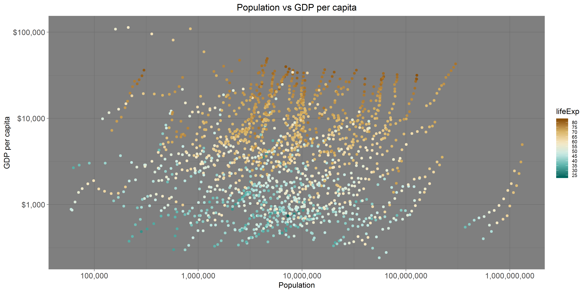

```{r load}
suppressPackageStartupMessages(library("gapminder"))
suppressPackageStartupMessages(library("tidyverse"))
suppressPackageStartupMessages(library("plotly"))
```


### Part 1: Factor management
##### Elaboration for the gapminder data set

- Drop Oceania. Filter the Gapminder data to remove observations associated with the continent of Oceania. Additionally, remove unused factor levels. Provide concrete information on the data before and after removing these rows and Oceania; address the number of rows and the levels of the affected factors.

```{r factor_check}
str(gapminder) #to confirm that continent variable is a factor
levels(gapminder$continent)
nlevels(gapminder$continent)
```

There are five levels in the continent variable of gapminder: Africa, Americas, Asia, Europe and Oceania. They are ordered alphabetically. In total, there 1704 observations (rows). Additionally, there 142 countries in total (ie 142 levels in a country factor).

```{r filtered_no_Oceania}
gap_no_oceania <- gapminder %>% 
  filter(!continent %in% c("Oceania")) %>% #remove part of data
  droplevels() 

str(gap_no_oceania)
nlevels(gap_no_oceania$continent)
levels(gap_no_oceania$continent)
```

After Oceania was filtered out, there are 1680 observations (rows) in the data frame. Additionally, because `droplevels()` was used, there are four continent levels now - Africa, Americas, Asia and Europe - since Oceania was removed. Also, there are now 140 levels in a country factor (`droplevels()` applies to the whole data frame).

- Reorder the levels of country or continent. Use the forcats package to change the order of the factor levels, based on a principled summary of one of the quantitative variables. Consider experimenting with a summary statistic beyond the most basic choice of the median.

Trying to plot the data using only `arrange()`:

```{r arranged}
gap_gdp_arranged <- gapminder %>%
  group_by(continent) %>% 
  summarize(wm = weighted.mean(gdpPercap, pop)) %>%  
  arrange(-wm) #descending order

str(gap_gdp_arranged)
levels(gap_gdp_arranged$continent)
knitr::kable(gap_gdp_arranged)
```

The continents in the table are in the decreasing order based on wm column; however, based on `levels()` function, the order of factor levels of the continent column is still alphabetical.

```{r arranged_plot_gdp_percontinent}
ggplot(gap_gdp_arranged, aes(continent, wm)) +
  geom_bar(stat="identity") +
  theme_light() +
  ggtitle("Weighted mean of GDP per capita per continent") +
  ylab("Weighted mean of gdpPercap based on pop") +
  theme(plot.title = element_text(hjust = 0.5)) + #centers the title
  geom_text(aes(label=round(wm, 0)), position=position_dodge(width=0.9), vjust=-0.25) #add labels over each bar
```

We can see that indeed the order of the continent levels on the graph is alphabetical, despite the fact that in the table they were arranged in a different order.

Trying with releveling:

```{r ordered_plot_gdp_percontinent}
ggplot(gap_gdp_arranged, aes(fct_inorder(continent), wm)) + #keeps the order that is present in the data frame
  geom_bar(stat="identity") +
  theme_light() +
  ggtitle("Weighted mean of GDP per capita per continent") +
  ylab("Weighted mean of gdpPercap based on pop") +
  xlab("continent") +
  theme(plot.title = element_text(hjust = 0.5)) + #centers the title
  geom_text(aes(label=round(wm, 0)), position=position_dodge(width=0.9), vjust=-0.25) #add labels over each bar
```

By using `fct_inorder()`, on the resulting graph, we order the continent levels by the order they appear in the table.

We can also use a different function - this time we can arrange continent levels in increasing order of weighted mean of gdpPercap:

```{r arranged_ordered_plot_increase}
gap_gdp_arranged %>% 
  mutate(continent = fct_reorder(continent, wm)) %>% 
  ggplot(aes(continent, wm)) + #keeps the order that is present in the data frame
  geom_bar(stat="identity") + #the height of the bar is the same as in table
  theme_light() +
  ggtitle("Weighted mean of GDP per capita per continent") +
  ylab("Weighted mean of gdpPercap based on pop") +
  xlab("continent") +
  theme(plot.title = element_text(hjust = 0.5)) + #centers the title
  geom_text(aes(label=round(wm, 0)), position=position_dodge(width=0.9), vjust=-0.25) #add labels over each bar
```

In this case, again it doesn't matter in which order the continents appear in the data frame. Since we reorder factor levels with forcats, that is how they are plotted. As such, we don't have to use `arrange()` at all for the purposes of the plot and simply order the factors using forcats:

```{r ordered_plot_increase}
gapminder %>%
  group_by(continent) %>% 
  summarize(wm = weighted.mean(gdpPercap, pop)) %>%
  mutate(continent = fct_reorder(continent, wm)) %>% #change factor order based on the gdpPercap weighted mean
  ggplot(aes(continent, wm)) + #keeps the order that is present in the data frame
  geom_bar(stat="identity") +
  theme_light() +
  ggtitle("Weighted mean of GDP per capita per continent") +
  ylab("Weighted mean of gdpPercap based on pop") +
  xlab("continent") +
  theme(plot.title = element_text(hjust = 0.5)) + #centers the title
  geom_text(aes(label=round(wm, 0)), position=position_dodge(width=0.9), vjust=-0.25) #add labels over each bar
```

The resulting plot is exactly the same as in the previous code chunk! So this confirms we don't need to `arrange()` the table before plotting. However, if we want to see the table rows in a specific order in the data frame itself, we do need to run `arrange()`.

### Part 2: File I/O:

- Modify gapminder object by filtering out countries with life expectancy less than 80 and releveling the country factor levels by population median.

```{r filtered_by_lifeExp}
gap_high_lifeExp <- gapminder %>% 
  filter(lifeExp >= 80) %>% 
  mutate(country = fct_drop(country)) %>% #drop unused levels in the country col
  group_by(country) %>% 
  summarize(md_pop = median(pop)) %>% 
  mutate(country = fct_reorder(country, md_pop)) #reorder factor levels based on the population median

knitr::kable(gap_high_lifeExp)
str(gap_high_lifeExp)
levels(gap_high_lifeExp$country)
```

There are now 13 country levels instead of 142. They are arranged by population median. We can now export the table through different functions:

```{r export}
write_csv(gap_high_lifeExp, "gapminder_filtered_byLifeExp_reordered.csv")
saveRDS(gap_high_lifeExp, "gapminder_filtered_byLifeExp_reordered.rds")
```

We can now see if the factor levels are in the same order as before export:
```{r re-import}
gap_high_lifeExp_csv <- read_csv("gapminder_filtered_byLifeExp_reordered.csv", col_types = list(col_factor(NULL), col_number())) #import as factors - otherwise the strings are imported as characters
levels(gap_high_lifeExp_csv$country)

gap_high_lifeExp_rds <- readRDS("gapminder_filtered_byLifeExp_reordered.rds")
levels(gap_high_lifeExp_rds$country)
```

The import as csv does not keep the factor levels in the same order. However, import of rds file does - the factor levels are ordered by population median as in the original data frame.

### Part 3: Visualization design:

Remake at least one figure or create a new one, in light of something you learned in the recent class meetings about visualization design and color. Maybe juxtapose your first attempt and what you obtained after some time spent working on it. Reflect on the differences. 

```{r initial_plot_pop_gdpPercap}
(p_initial <- gapminder %>% 
    ggplot(aes(pop, gdpPercap)) +
    geom_point(aes(colour = lifeExp)))
  
```

```{r final_plot_pop_gdpPercap}
library(scales)
(p_final <- gapminder %>% 
    ggplot(aes(pop, gdpPercap)) +
    geom_point(aes(colour = lifeExp)) +
  labs(title = "Population vs GDP per capita",
       x = "Population",
       y = "GDP per capita") +
  scale_y_log10(labels = dollar_format()) +
  scale_x_log10(labels = comma_format()) +
  scale_colour_distiller(palette = "BrBG",
                         breaks = seq(20, 100, by=5)) +  
  theme_dark() +
  theme(axis.text = element_text(size=11),
        legend.text = element_text(size=7), #smaller legend font size -> easier to see the numbers as they don't overlap
        plot.title = element_text(hjust = 0.5))) #centers the title
```

The final plot is easier to interpret - the data is not squished in the left corner after log transformation; the colouring also allows to see more correlations - for example, countries with lower gdp per capita generally have lower life expectancy. Additionally, the labels on the axes are easier to read.


Then, make a new graph by converting this visual (or another, if you'd like) to a plotly graph. What are some things that plotly makes possible, that are not possible with a regular ggplot2 graph?

```{r plotly}
#ggplotly(p_final)
```

Plotly object is much more interactive than ggplot object. For example, when we put the mouse over a data point, plotly object shows the actual value for it, which is quite useful (otherwise, it is only a general sense of the values). Also, plotly allows to save the object, zoom in/out, select the regions on the plot.

### Part 4: Writing figures to file:

```{r export_plot}
ggsave("Plot_pop_gdpPercap.png", plot = p_final, width = 30, height = 15, units = "cm", dpi = "print")
ggsave("Plot_pop_gdpPercap.pdf", plot = p_final, width = 60, height = 30, units = "cm", scale = 3, limitsize=F)
```

Explicit provision `plot` parameter in `ggsave()` function matters if we want to save not the last plot displayed (ie default) but another object. 

